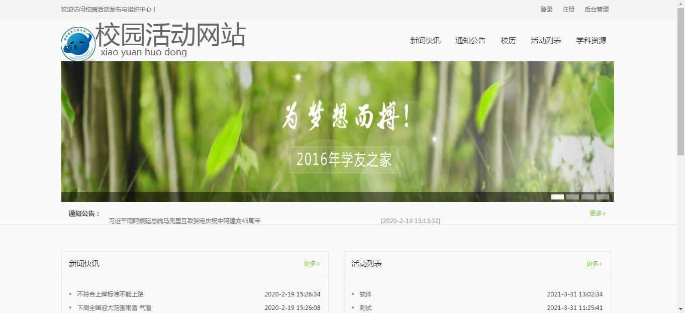
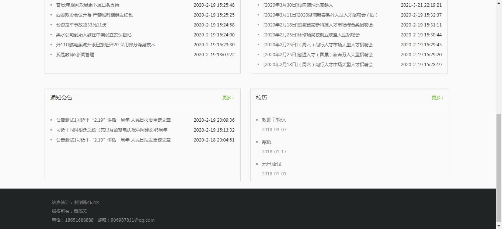
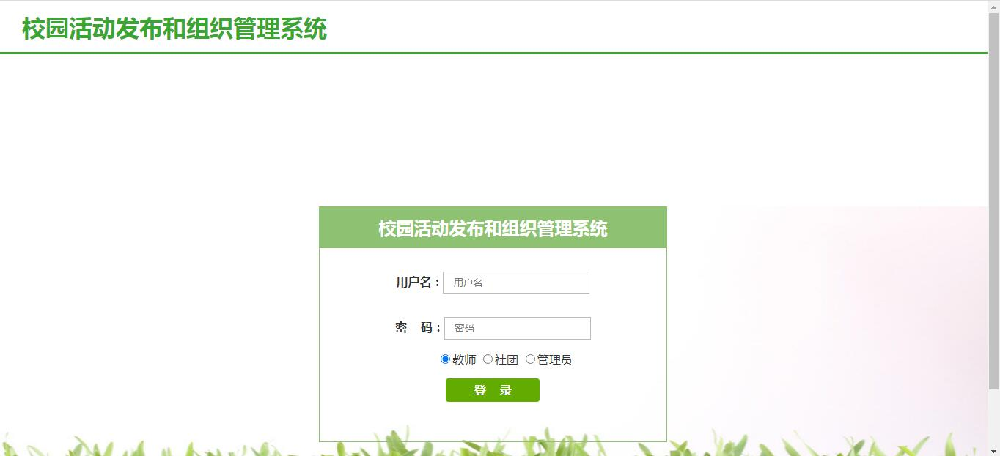
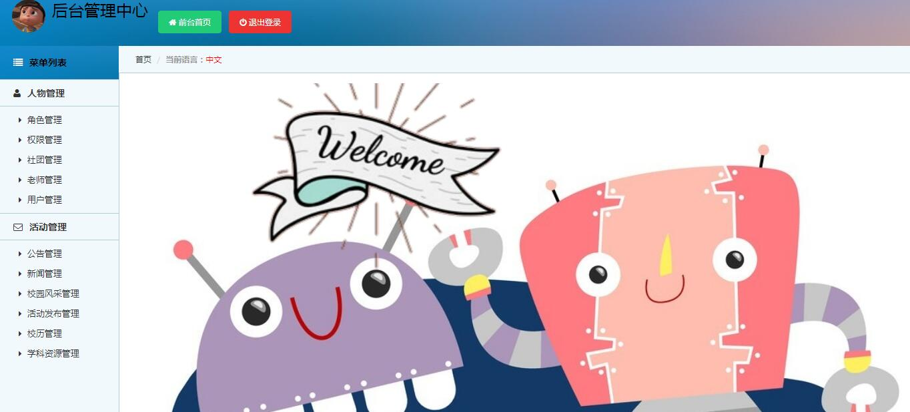
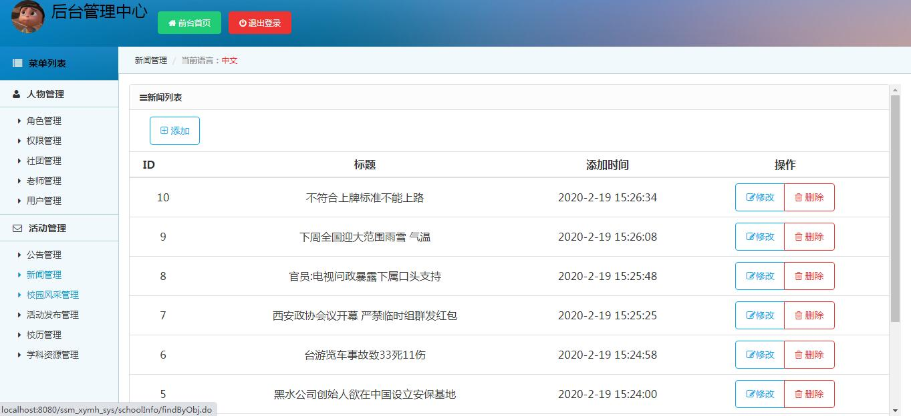
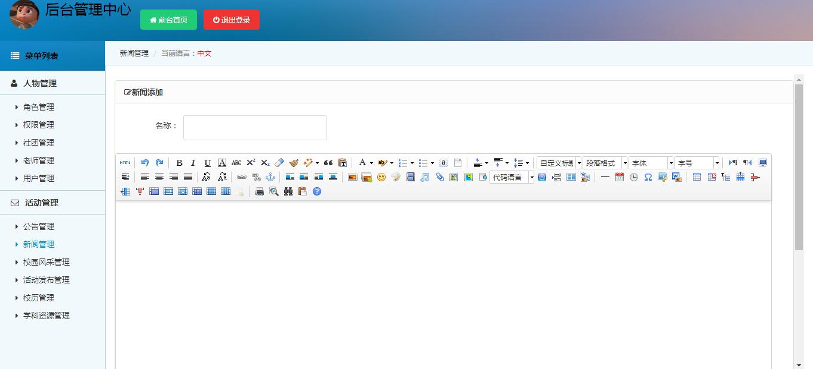

<h1 align="center">校园活动管理系统</h1>

## 简介
校园活动管理系统：角色分为教师、社团、管理员；功能包括角色管理、权限管理、用户管理、新闻管理、活动发布和组织管理，全方位满足校园活动的组织和内容管理需求。    --计算机毕业设计源码；毕设源码；java毕业设计源码

## 联系方式

<h3 align="center">获取完整代码与数据库文件 + 微信：bysj5151 QQ: 86050149 QQ群: 783742310</h3>

<h3 align="center">可帮忙远程部署 包运行成功！提供远程部署、修改代码、设计文档指导、代码讲解等服务！</h3>

## 功能介绍（完整见运行截图）
管理员：基本功能包括登录、注册和退出。管理系统功能涵盖角色管理、权限管理、用户管理、公告管理等，可进行角色和权限的配置与调整，管理新闻和活动信息，以及查看与编辑网站内容。管理员还可以使用新闻添加模块创建和发布新闻，包含插入图像和表格等选项。系统顶部提供快速导航返回首页和退出登录。

教师：教师可在校园活动管理系统中根据自身身份获得适当的权限，查看与管理与教学相关的活动和新闻信息。可访问通知公告和校历信息，了解重要日期和事件，如教职工轮休、寒假安排。通过角色选择，教师可以参与社团活动管理和相关校园活动组织。

社团：社团用户在系统中可访问和管理相关社团活动信息，查看最新新闻公告以及组织校园活动。提供活动列表，帮助社团成员发布和管理活动。社团用户可以通过校园活动发布与管理系统的功能快速获取信息，参与到校园活动的组织与协调中。

用户：普通用户可以通过系统登录界面进入校园活动管理系统，通过选择用户角色来获得相应权限。用户可查看最新的新闻快讯和活动公告，参与C活动及查看校历信息，以便获取重要通知和安排。用户界面简单友好，右侧活动列表和校历显示，方便用户查看与参与活动。

## 运行截图

本代码来源于网络,仅供学习参考使用!

